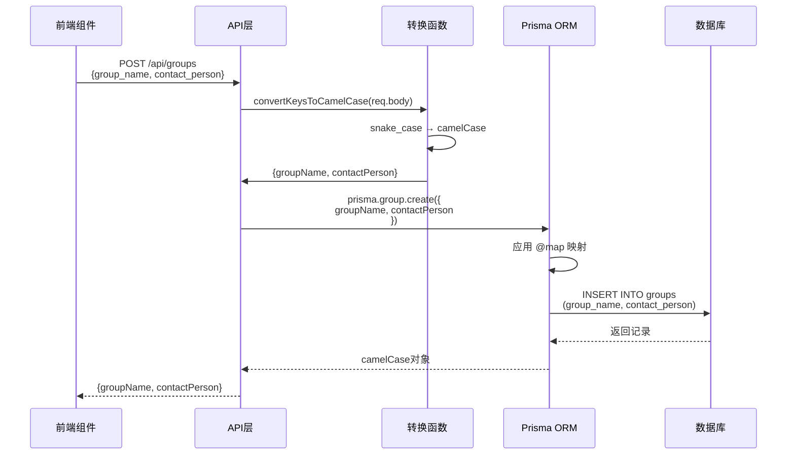
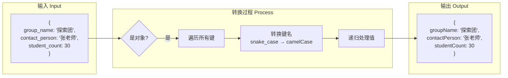
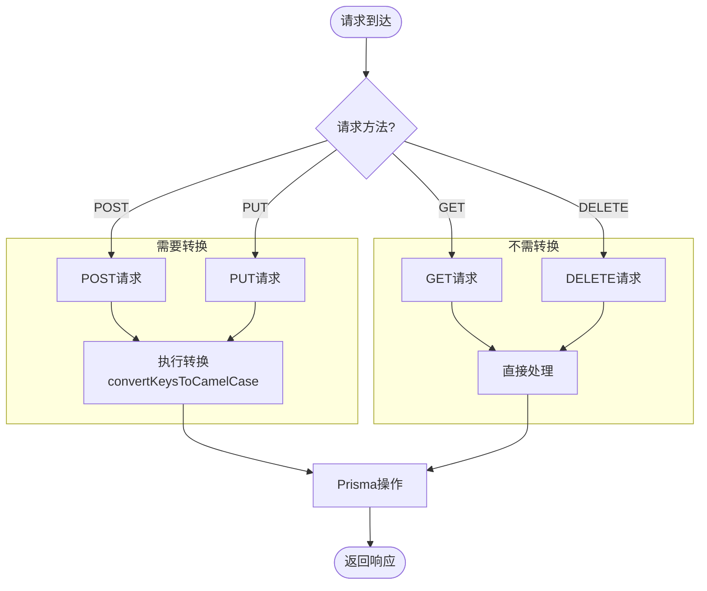
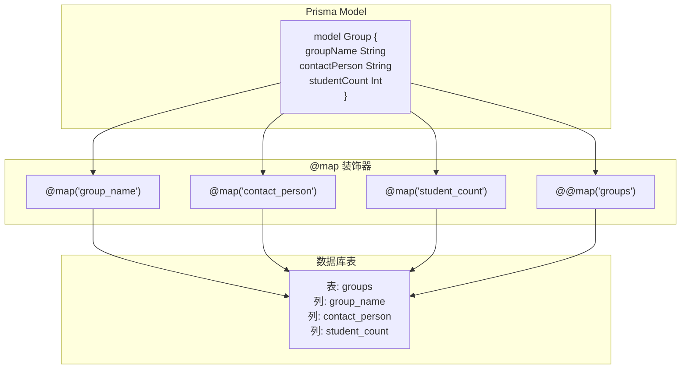
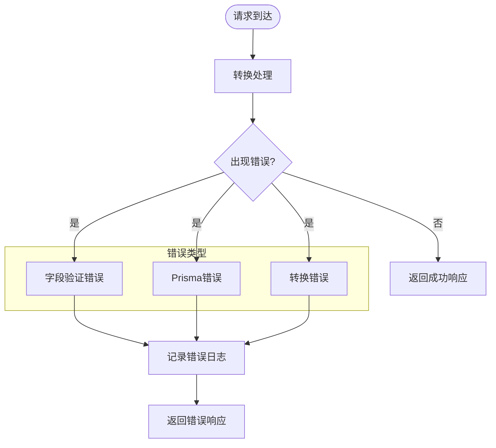
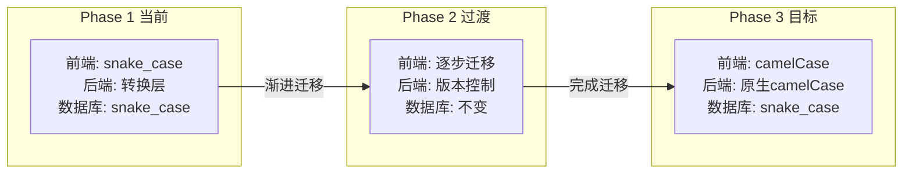

# 命名规范转换流程图

## 数据流转全景图

```mermaid
graph TB
    subgraph "前端 Frontend"
        FE[前端组件<br/>snake_case]
        FE_API[API调用层<br/>发送 snake_case]
    end

    subgraph "后端 Backend API"
        API_IN[API接收<br/>req.body snake_case]
        CONVERT[转换层<br/>convertKeysToCamelCase]
        API_PROCESS[业务处理<br/>camelCase]
    end

    subgraph "Prisma ORM"
        PRISMA[Prisma Client<br/>camelCase]
        MAPPING[@map映射器]
    end

    subgraph "数据库 Database"
        DB[(SQLite<br/>snake_case)]
    end

    FE --> FE_API
    FE_API -->|POST/PUT| API_IN
    API_IN --> CONVERT
    CONVERT -->|转换| API_PROCESS
    API_PROCESS --> PRISMA
    PRISMA --> MAPPING
    MAPPING -->|映射| DB

    DB -->|查询结果| MAPPING
    MAPPING -->|逆映射| PRISMA
    PRISMA -->|camelCase| API_PROCESS
    API_PROCESS -->|返回数据| FE_API
    FE_API -->|camelCase| FE
```

## 创建团组请求流程



## 转换函数工作原理



## API端点处理流程



## Prisma Schema映射示例



## 特殊字段处理流程

```mermaid
flowchart LR
    subgraph "前端发送"
        FRONT["{<br/>  group_name: '团组',<br/>  members: [...],<br/>  schedules: [...],<br/>  tags: ['教育']<br/>}"]
    end

    subgraph "转换处理"
        CONV[转换为camelCase]
        REMOVE[移除临时字段<br/>- members<br/>- schedules]
        JSON_CONV[JSON序列化<br/>- tags]
    end

    subgraph "Prisma接收"
        PRISMA["{<br/>  groupName: '团组',<br/>  tags: '[\"教育\"]'<br/>}"]
    end

    FRONT --> CONV
    CONV --> REMOVE
    REMOVE --> JSON_CONV
    JSON_CONV --> PRISMA
```

## 错误处理流程



## 响应数据流程（当前状态）

```mermaid
graph TB
    subgraph "数据库查询"
        DB_QUERY[SELECT * FROM groups]
        DB_RESULT[snake_case结果]
    end

    subgraph "Prisma处理"
        PRISMA_MAP[应用@map逆映射]
        PRISMA_RESULT[camelCase对象]
    end

    subgraph "API响应"
        API_RESP[直接返回camelCase]
    end

    subgraph "前端处理"
        FE_RECV[接收camelCase]
        FE_HANDLE[需要处理命名差异]
    end

    DB_QUERY --> DB_RESULT
    DB_RESULT --> PRISMA_MAP
    PRISMA_MAP --> PRISMA_RESULT
    PRISMA_RESULT --> API_RESP
    API_RESP --> FE_RECV
    FE_RECV --> FE_HANDLE

    style FE_HANDLE fill:#ffcccc
```

## 未来优化方向



---

## 快速参考

### 需要转换的API端点
- ✅ POST /api/groups
- ✅ PUT /api/groups/:id
- ✅ PUT /api/groups/:groupId/activities
- ✅ POST /api/educational-resources
- ✅ PUT /api/educational-resources/:id
- ✅ POST /api/theme-packages
- ✅ PUT /api/theme-packages/:id

### 不需要转换的API端点
- ⭕ GET /api/*
- ⭕ DELETE /api/*

### 关键文件位置
- 转换函数: `/backend/server-db.js:14-33`
- Prisma Schema: `/backend/prisma/schema.prisma`
- API配置: `/frontend/src/services/api.js`